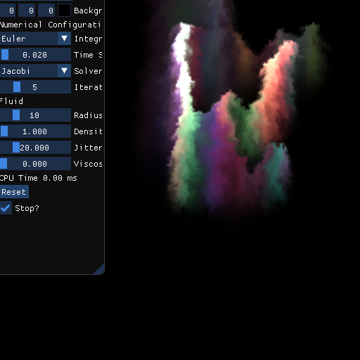
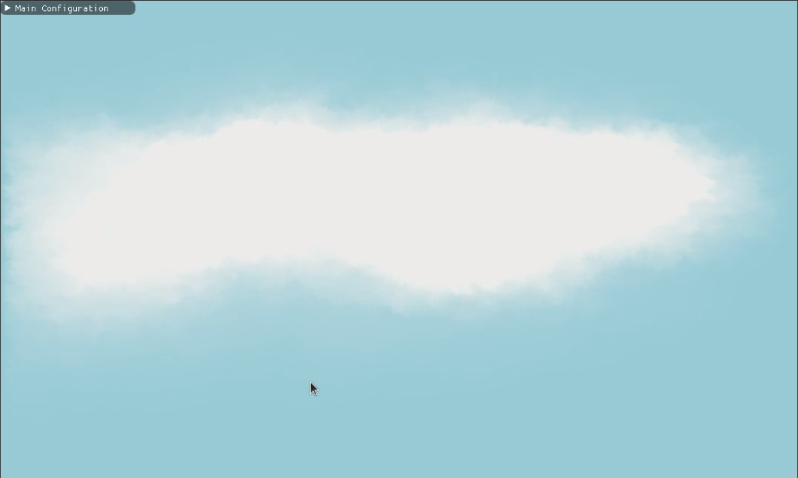

# Fluid simulation

2D fluid simulation using CUDA and openGL, interface using imgui. 
There are two implementations, one that uses CPU and one that uses GPU (via CUDA)

## Outputs
* CPU fluid simulation

* [clickable video] GPU fluid simulation

* [clickable video] you can do cool projects like cloud simulation as well :)

## Report
detailed explanation is coming up soon!

## Resources
* Braley, Colin and Adrian Sandu. Fluid Simulation For Computer Graphics: A Tutorial in Grid Based and Particle Based Methods, 2009.
* Bridson, Robert. Fluid Simulation for Computer Graphics. CRC Press, 2016.
* Harris, Mark. “Chapter 38. Fast Fluid Dynamics Simulation on the GPU.” GPU Gems. Nvidia, https://developer.nvidia.com/gpugems/gpugems/part-vi-beyond-triangles/chapter-38-fast-fluid-dynamics-simulation-gpu 
* https://vccvisualization.org/CS247_Scientific_Visualization/
* https://vccvisualization.org/CS380_GPU_and_GPGPU_Programming/
* https://developer.download.nvidia.com/assets/cuda/files/reduction.pdf
* https://mikeash.com/pyblog/fluid-simulation-for-dummies.html
* https://github.com/983/Fluid-Simulation